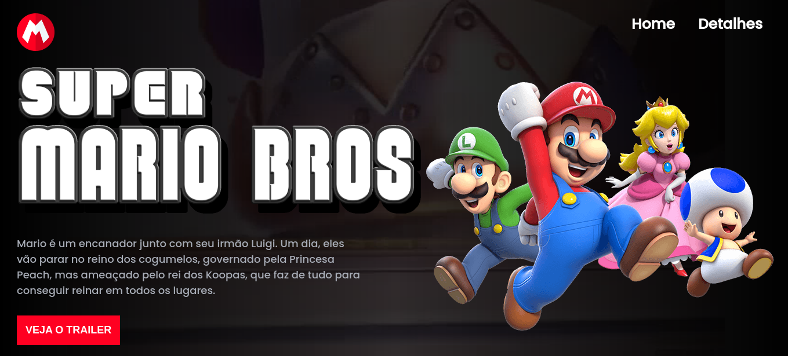
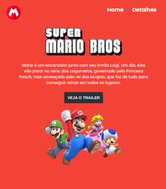
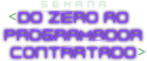

<h1 align="center">
  Mario Bros. - O Filme
</h1>

<div align="center">
  <a href="#-projeto">Projeto</a>&nbsp;&nbsp;&nbsp;|&nbsp;&nbsp;&nbsp;
  <a href="#-tecnologias">Tecnologias</a>&nbsp;&nbsp;&nbsp;|&nbsp;&nbsp;&nbsp;
  <a href="#-tecnologias">Executar Aplicação</a>&nbsp;&nbsp;&nbsp;|&nbsp;&nbsp;&nbsp;
  <a href="#-licença">Licença</a>&nbsp;&nbsp;&nbsp;|&nbsp;&nbsp;&nbsp;
  <a href="#-autor">Autor</a>
</div>

<br> 

<p align="center">
  
  
  
</p>

<br>

## 💻 Projeto

Projeto landing page em virtude da estreia do filme Mario Bros, este foi desenvolvido apenas com HTML5, CSS3 e Javascript para aprimorar minhas habilidades.

- [Visitar site do projeto](https://wanderson-a-timoteo.github.io/mariobros/)

### Tela em desktop

<p align="center">
    
</p>
<br>

### Tela em Mobile

<p align="center">
    
</p>
<br>

### Gif da Landing Page
<p align="center">
    
</p>
<br>

## 🚀 Tecnologias

Esse projeto foi desenvolvido com as seguintes tecnologias e ferramentas:

- [HTML5](https://www.w3schools.com/html/)
- [CSS3](https://www.w3schools.com/css/default.asp)
- [Javascript](https://developer.mozilla.org/pt-BR/docs/Web/JavaScript)

<br>

## 🔥 Executar Aplicação

### 🎇 Executando Localmente a Aplicação

Caso você deseja executar o projeto na sua máquina local, basta seguir os passos abaixo:

### 🌀 Começando...

Para começar, você deve simplesmente clonar o repositório do projeto na sua máquina.

Navegue em seu computador até o local onde você clonou o projeto, exemplo:

```sh
C:\Users\NomeDoComputador\Documents\CloneDoProjeto
```

Quando encontrar a pasta do projeto, basta acessar `mariobros`. 

### 🛰️ Executando o projeto

Bom, agora que esta **(dentro da pasta `mariobros` do projeto clonado)**. Dentro desta pasta tem um arquivo index.html que é o arquivo principal do projeto. Clique duas vezes seguidas neste arquivo.

Pronto! dessa forma o projeto `mariobros` estará rodando localmente em sua maquina.

<br>

## 🚩 Tenho Dúvidas... O que fazer?

Caso tenha dúvidas sobre o código do projeto, sintam-se a vontade em abrir uma **[ISSUE AQUI](https://github.com/Wanderson-A-Timoteo/mariobros/issues)**. Assim que possível, responderei todas as dúvidas!

<br>

## 💡 Licença

Esse projeto está sob a licença MIT. Veja o arquivo [LICENSE](github/LICENSE.md) para mais detalhes.

<br>

## 🎆 Autor

Feito com ♥ by

-  [**Wanderson A. Timóteo**](https://www.wandersontimoteo.ga/)

<br>

## 🤝 Agradecimentos


<div align="center">
  

<br>

<div align="center">
  

<br>

- Projeto desenvolvido durante a ` Semana do Zero ao Programador Contratado ` da plataforma de Ensino [Dev Em Dobro](https://devemdobro.com/).
